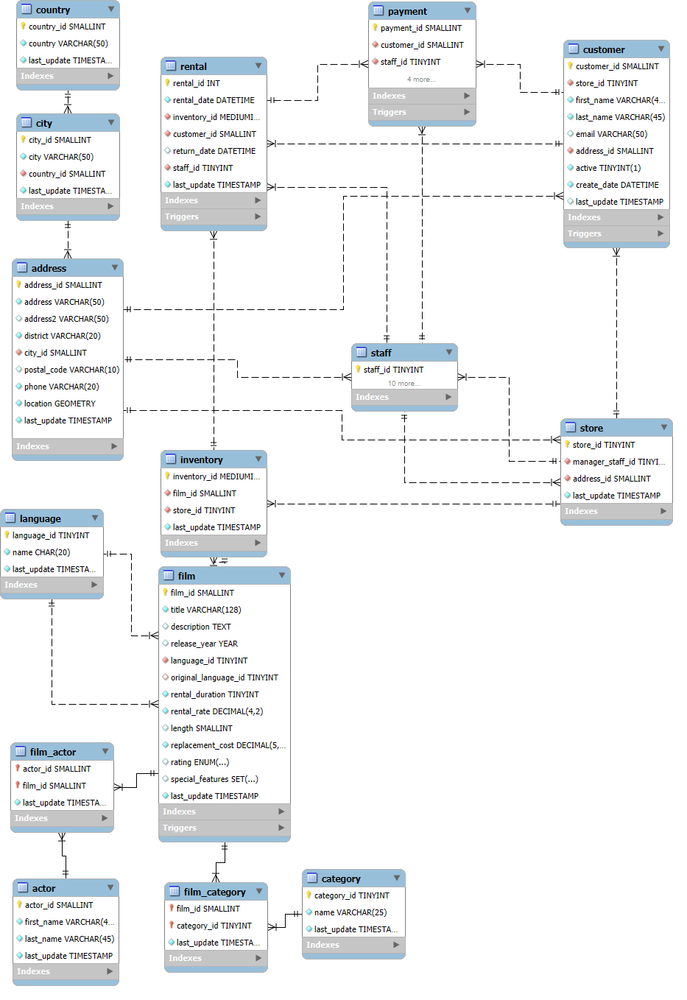

<div class="main-content">
# Pendahuluan

## Deskripsi Dataset

<p>Dataset Sakila merupakan dataset basis data relasional bertema sistem penyewaan film/DVD yang digunakan untuk pembelajaran dan analisis data. Dataset ini berisi data film, pelanggan, aktor, kategori, inventaris, transaksi penyewaan, pembayaran, serta informasi toko dan lokasi. Struktur data pada dataset Sakila tersusun dalam beberapa tabel yang saling berelasi sehingga cocok digunakan untuk analisis database, pengolahan data, dan penerapan query SQL.</p>

<p>Buka <a href=" https://dev.mysql.com/doc/index-other.html " target="_blank" rel="noopener noreferrer">Kumpulan Data Sakila</a> untuk detail sumber data yang digunakan.</p>

## Struktur Dataset

<p>**Struktur data** pada dataset Sakila disusun dalam bentuk basis data relasional yang terdiri atas `16 tabel` yang saling terhubung melalui *relasi primary key* dan *foreign key*. Tabel-tabel tersebut memuat data `film`, `aktor`, `pelanggan`, `kategori`, `inventaris`, `penyewaan`, `pembayaran`, `toko`, serta `lokasi`. Relasi antar tabel digunakan untuk menggambarkan proses bisnis penyewaan film sehingga data dapat dikelola dan dianalisis secara terintegrasi.</p>

Berikut merupakan Entity Relationship Diagram (ERD) dari dataset Sakila.


## Insight Data

<div class="callout-box info">**Rating film** (`G`, `PG`, `PG-13`, `R`, `NC-17`) bukan sekadar label administratif. Dalam industri film, rating merepresentasikan segmen `audiens yang ditargetkan`, `batasan usia`, dan `sering kali` berkorelasi dengan `genre` dan `durasi film`. Namun apakah rating secara signifikan memengaruhi kinerja bisnia? atau apakah semua rating memiliki peforma yang sama?<br>Untuk mengetahui hal tersebut, maka dibuat beberapa pertanyaan yang bisa mengarah ke 1 kesimpulan yang membuktikan pengaruh rating.<br>
1. Apakah distribusi volume rental berbeda secara signifikan antar rating film?<br>
2. Apakah ada hubungan antara rating film dan perilaku keterlambatan pengembalian?<br>
3. Apakah nilai pembayaran per transaksi berbeda signifikan antar rating, dan apakah perbedaan ini konsisten di kedua toko fisik?
</div>

<h2>Tabel Data yang Digunakan</h2>
<p>Untuk menganalisis insight yang sudah didapat, akan digunakan beberapa tabel yaitu :</p>
<div class="custom-table">
  <table>
    <thead>
      <tr>
        <th>Tabel</th>
        <th>Deskripsi</th>
        <th>Kolom Kunci</th>
      </tr>
    </thead>
    <tbody>
      <tr>
        <td>`rental`</td>
        <td>Transaksi rental dengan timestamp waktu penyewaan dan pengembalian.</td>
        <td>`rental_id` `rental_date` `return_date`</td>
      </tr>
      <tr>
        <td>`inventory`</td>
        <td>Stok film per toko, yang menghubungkan data rental ke entitas toko dan film.</td>
        <td>`inventory_id` `film_id` `store_id`</td>
      </tr>
      <tr>
        <td>`film`</td>
        <td>Atribut utama film termasuk rating, durasi, dan harga rental.</td>
        <td>`film_id` `rating`, `length`, `rental_rate`</td>
      </tr>
      <tr>
        <td>`payment`</td>
        <td>Data pembayaran (di-LEFT JOIN karena terdapat indikasi transaksi rental tanpa payment).</td>
        <td>`payment_id`, `rental_id`, `amount`</td>
      </tr>
    </tbody>
  </table>
</div>

# Persiapan Data
<p>persiapan data dilakukan untuk memastikan data siap digunakan pada proses analisis. Tahapan ini meliputi proses pengambilan data dari database Sakila, pemeriksaan struktur tabel dan tipe data, pengecekan relasi antar tabel, serta identifikasi data yang kosong atau tidak sesuai. Selain itu, dilakukan pemilihan tabel dan atribut yang relevan sesuai kebutuhan analisis agar proses pengolahan data dapat berjalan lebih terstruktur dan efisien.</p>

## Library yang Digunakan
<p>Pada tahap analisis data, digunakan beberapa library dalam bahasa R untuk mendukung proses pengolahan, visualisasi, dan analisis data. Library yang digunakan berfungsi untuk mempermudah koneksi database, manipulasi data, pembuatan visualisasi, serta penyajian hasil analisis.</p>

<details class="modern-code-fold">
  <summary>Kode Chunk Library dan Tema ggplot</summary>
```{r results='hide',message=FALSE,warning=FALSE, error=FALSE}
library(DBI) #library koneksi database ke R
library(tidyverse) #library untuk visualisasi data dan olah data
library(janitor) #libary untuk preprocecing dataa

# Tema ggplot
theme_laporan <- theme_minimal(base_size = 11) +
  theme(
    plot.title = element_text(face = "bold", size = 13, color = "#1a3a52"),
    plot.subtitle = element_text(size = 10, color = "#666"),
    axis.title = element_text(face = "bold", size = 10),
    axis.text = element_text(size = 9),
    panel.grid.major = element_line(color = "#f0f0f0", size = 0.3),
    legend.position = "bottom"
  )
theme_set(theme_laporan)

col_primary <- "#1a3a52"
col_accent <- "#d4840a"
col_success <- "#27ae60"
```
</details>

<div class="custom-table">
  <table>
    <thead>
      <tr>
        <th>Package</th>
        <th>Deskripsi</th>
        <th>Fungsi yang digunakan</th>
      </tr>
    </thead>
    <tbody>
      <tr>
        <td>`DBI`</td>
        <td>Library atau Packages yang digunakan untuk koneksi database SQl ke R.</td>
        <td>`dbConnect()` `dbGetQuery()`</td>
      </tr>
      <tr>
        <td>`tidyverse`</td>
        <td>Meta-package yang menyediakan berbagai package untuk analisis dan visualisasi data dalam R.</td>
        <td>`library(tidyverse)`</td>
      </tr>
      <tr>
        <td>`ggplot2`</td>
        <td>Package visualisasi data berbasis Grammar of Graphics untuk membuat grafik analitik.</td>
        <td>`ggplot()`, `aes()`, `geom_col()`, `labs()`, `theme_minimal()`</td>
      </tr>
      </tbody>
  </table>
</div>
## Koneksi SQL

<p>Pada tahap ini dilakukan koneksi antara R dan database MySQL yang berisi dataset Sakila. Koneksi dilakukan menggunakan package `DBI` dan `odbc` agar data pada database dapat diakses dan dianalisis secara langsung melalui R.<br>

Proses koneksi menggunakan parameter berupa `driver database`, `server`, `nama database`, `username`, `password`, dan `port`. Setelah koneksi berhasil dilakukan, data dapat diambil menggunakan query SQL untuk proses analisis dan visualisasi lebih lanjut.</p>

<details class="modern-code-fold">
  <summary> Chunk Kode Koneksi Database</summary>
```{r error=FALSE, message=FALSE, warning=FALSE, results='hide'}
con <- DBI::dbConnect(odbc::odbc(),
  Driver = "MySQL ODBC 8.0 ANSI Driver",
  Server = Sys.getenv("MYSQL_HOST"),
  Database = "sakila",
  UID = Sys.getenv("MYSQL_UID"),
  PWD = Sys.getenv("MYSQL_PWD"),
  Port = as.integer(Sys.getenv("MYSQL_PORT"))
)
```
</details>

## Pengambilan Data (Data Extraction)

<p>Query SQL digunakan untuk menggabungkan tabel `payment`, `rental`, `inventory`, `film`, dan `store` guna menganalisis pengaruh rating film terhadap performa bisnis rental. Data yang diambil digunakan untuk membandingkan volume rental, keterlambatan pengembalian, serta nilai pembayaran transaksi pada setiap kategori rating film. Proses pengolahan dilakukan menggunakan operasi `JOIN`, agregasi data, dan pengelompokan berdasarkan rating film dan toko</p>

<details class="modern-code-fold">
  <summary> Chunk Kode Pengambilan data menggunakan SQL</summary>
```{r results='hide',message=FALSE,warning=FALSE, error=FALSE}
# Membuat variabel berisi data yang diambil dari database
dataset<- dbGetQuery(con, "SELECT 
r.rental_id, 
r.rental_date, 
r.return_date, 
r.customer_id, 
i.store_id,
i.film_id, 
f.title, 
f.rating, 
f.rental_duration, 
f.length, 
f.rental_rate, 
p.amount, 
p.payment_date
FROM rental r
INNER JOIN inventory i ON r.inventory_id = i.inventory_id
INNER JOIN film f ON i.film_id = f.film_id
LEFT JOIN payment p ON r.rental_id = p.rental_id
WHERE r.return_date IS NOT NULL
ORDER BY r.rental_date
")
```
</details>

## Preprocessing Data
<p>Data yang telah diperoleh kemudian diproses lebih lanjut melalui tahap preprocessing untuk memastikan konsistensi format data dan mempermudah proses analisis. Tahapan preprocessing meliputi standardisasi nama variabel, konversi tipe data tanggal-waktu, serta pembentukan variabel turunan terkait durasi penyewaan dan keterlambatan pengembalian film.</p>

<details class="modern-code-fold">
  <summary> Chunk Kode Preprocessing Data</summary>
```{r results='hide',message=FALSE,warning=FALSE, error=FALSE}
dataset <- dataset |>
  clean_names() |>
  mutate(
    rental_date = ymd_hms(rental_date),
    return_date = ymd_hms(return_date),
    actual_days = as.numeric(
      difftime(return_date, rental_date, units = "days")
    ),
    is_late = actual_days > rental_duration,
    days_late = pmax(actual_days - rental_duration, 0)
  )
```
</details>

<details class="modern-code-fold">
  <summary>Hasil Sample Data dari Query</summary>
  
```{r echo=FALSE}
dataset |>
  head(10) |>
  select(rental_id, rental_date, return_date, customer_id, store_id, 
         title, rating, amount) |>
  knitr::kable() |>
  kableExtra::kable_styling(bootstrap_options = c("striped", "hover"))
``` 
</details>

# Exploratory Data Analysis
<p>Tahap Exploratory Data Analysis (EDA) dilakukan untuk memahami karakteristik data serta mengidentifikasi pola, distribusi, dan hubungan antar variabel yang berkaitan dengan rating film dan performa bisnis rental. Pada tahap ini dilakukan analisis deskriptif dan visualisasi data untuk mengeksplorasi volume rental, keterlambatan pengembalian, serta nilai pembayaran transaksi pada setiap kategori rating film.<br>
Hasil EDA digunakan sebagai dasar untuk menemukan insight awal dan mendukung proses analisis statistik lebih lanjut.</p>

## Analisis Statistik Deskriptif
<p>Analisis statistik deskriptif dilakukan untuk menggambarkan karakteristik data secara umum berdasarkan rating film. Pada tahap ini dilakukan perhitungan ukuran statistik seperti jumlah transaksi, rata-rata pembayaran, nilai minimum, maksimum, serta distribusi data rental dan keterlambatan pengembalian.<br>
Analisis ini bertujuan untuk memberikan gambaran awal mengenai pola performa bisnis pada setiap kategori rating film sebelum dilakukan analisis statistik lanjutan.</p>

<details class="modern-code-fold">
  <summary> Chunk Kode Statistik Deskriptif</summary>
```{r error=FALSE, message=FALSE, warning=FALSE, results='hide'}
# Statistik deskriptif berdasarkan rating film
stat_deskriptif <- dataset |>
  group_by(rating) |> 
  summarise(total_rental = n(),
            rata_pembayaran = round(mean(amount, na.rm = TRUE),),
            minimum_pembayaran = round(min(amount, na.rm = TRUE),2),
            maksimum_pembayaran = round(max(amount, na.rm = TRUE), 2),
            rata_hari_rental = round(mean(actual_days, na.rm = TRUE), 2),
            total_terlambat = sum(is_late, na.rm = TRUE),
            persentase_terlambat = round(mean(is_late, na.rm = TRUE) * 100, 2),
            rata_hari_terlambat = round(mean(days_late, na.rm = TRUE), 2)) |>
  arrange(desc(total_rental))
```
</details>


<div class="table">

```{r, echo=FALSE}
stat_deskriptif |>
  knitr::kable(
    caption = "Statistik Deskriptif Berdasarkan Rating Film"
  ) |>
  kableExtra::kable_styling(
    bootstrap_options = c("striped", "hover", "condensed"),
    full_width = FALSE
  )
```

</div>

<div class="callout-box info">

Rating `PG-13` memiliki jumlah transaksi rental tertinggi, sedangkan rating `G` memiliki jumlah rental terendah. Rata-rata pembayaran dan durasi rental pada seluruh rating cenderung seragam, yaitu sekitar `$4` dan `5 hari`. Dari sisi keterlambatan, rating `R` dan `G` menunjukkan persentase keterlambatan tertinggi dibanding rating lainnya.

</div>

## Visualisasi dan Interpretasi {.tabset .tabset-fade .tabset-pills}

### Payment Berdasarkan Rating Film

<details class="modern-code-fold">
  <summary>Bos Plot</summary>

```{r, message=FALSE, warning=FALSE}
boxplot<-ggplot(dataset,aes(x = rating,y = amount,fill = rating)) +
  geom_boxplot(alpha = 0.8,outlier.alpha = 0.3) +
  scale_fill_brewer(palette = "Set2") +
  labs(
    title = "Distribusi Nilai Pembayaran Berdasarkan Rating Film",
    subtitle = "Analisis variasi payment antar kategori rating",
    x = "Rating Film",
    y = "Nilai Pembayaran ($)") +
  theme_laporan +
  theme(legend.position = "none")
```

</details>
<div class="plot-centered-shadow">
```{r echo=FALSE}
boxplot
```
</div>

<div class="callout-box info">

Distribusi nilai pembayaran pada seluruh kategori rating film menunjukkan pola yang relatif mirip dengan median pembayaran berada di sekitar `$4`. Meskipun demikian, rating `G` dan `R` memiliki sebaran pembayaran yang sedikit lebih luas dibanding kategori lainnya. Selain itu, terdapat beberapa transaksi dengan nilai pembayaran tinggi (*outlier*) pada seluruh rating, yang menunjukkan adanya transaksi rental dengan pembayaran di atas pola umum transaksi.

</div>

### Keterlambatan Pengembalian

<details class="modern-code-fold">
  <summary>Stacked bar Chart</summary>

```{r, message=FALSE, warning=FALSE}
# menambah status keterlambatan
bar_chart<-dataset |>
  mutate(
    status_keterlambatan = ifelse(
      is_late,
      "Terlambat",
      "Tepat Waktu")) |>
  ggplot(aes(x = rating, fill = status_keterlambatan)) +
  geom_bar(position = "fill") +
  scale_y_continuous(labels = scales::percent) +
  scale_fill_manual(
    values = c(
      "Terlambat" = "#d4840a",
      "Tepat Waktu" = "#1a3a52")) +
  labs(
    title = "Proporsi Keterlambatan Berdasarkan Rating Film",
    subtitle = "Perbandingan transaksi terlambat dan tepat waktu",
    x = "Rating Film",
    y = "Proporsi",
    fill = "Status Rental") +
  theme_laporan
```

</details>

<div class="plot-centered-shadow">
```{r echo=FALSE}
bar_chart
```
</div>

<div class="callout-box info">
Proporsi keterlambatan pengembalian rental pada seluruh kategori rating terlihat seimbang. namun rating `R` dan `PG-13` menunjukkan persentase keterlambatan yang sedikit lebih tinggi dibanding kategori lain. sebaliknya, rating `NC-17` memiliki proporsi pengembalian tepat waktu yang relatif besar. Pola ini menandakan bahwa terdapat perbedaaan perilaku pelanggan dalam pengembalian rental film masing-masing kategori film, meski perbedaannya tidak terlalu ekstrim.
</div>

### Perbandingan Antar Toko

<details class="modern-code-fold">
  <summary>Geoup Bar Chart</summary>

```{r message=FALSE, warning=FALSE}

bar_chart1<-dataset |>
  group_by(store_id, rating) |>
  summarise(
    rata_pembayaran = mean(
      amount,
      na.rm = TRUE)) |>
  ggplot(aes(x = rating,y = rata_pembayaran,fill = factor(store_id))) +
  geom_col(position = "dodge") +
  scale_fill_manual(values = c("#1a3a52","#d4840a")) +
  labs(
    title = "Perbandingan Rata-rata Pembayaran Antar Toko",
    subtitle = "Rata-rata payment berdasarkan rating film dan toko",
    x = "Rating Film",
    y = "Rata-rata Pembayaran ($)",
    fill = "Store ID") + theme_laporan
```

</details>

<div class="plot-centered-shadow">
```{r echo=FALSE}
bar_chart1
```
</div>

<div class="callout-box info">
Rata-rata pembayaran pada ke-2 toko menunjukkan pola yang relatif konsisten pada seluruh kategori rating film. `Strroe 1` memiliki nilai pembayaran yang cenderung sedikit lebih tinggi dibanding `Store 2` pada setiap rating, namun selisihnya tidak terlalu besar. selalin itu, rating `G` dan `NC-17` memiliki rata-rata pembayaran tertinggi, sedangkan rating `R` menunjukkan rata-rata pembayaran paling rendah pada kedua toko. pola ini menandakan bahwa peforma transaksi antar toko relatif serupa dengan perbedaan yang tidak terllu signifikan.
</div>

## Potensi Hipotesis
<p>tahap potensi hipotesis dilakukan untuk menyusun dugaan awal berdasarkan pola yang ditemukan pada analisis deskriptif dan visualisasi data. hipotesis digunakan sebagai dasar dalam memutuskan apakah terdapat perbedaan atau hubungan yang signifikan atau hanya disebabkan oleh variasi acak.<br>
Hipotesis yang akan di uji difokuskan pada pengaruh rating film terhadap peforma bisnis, khuususnya pada nilai pembayaran, keterlambatan pengembalian, dan peforma antar toko. pengujian hipotesis dilakukan dengan menggunakan metode uji staitsik non parametrik uyang disesuaikan dengan data dan jenis variabel analisis.</p>

### Perbedaan nilai pembayaran antar rating
$H_0$ : Distribusi nilai pembayaran sama pada semua kategori film<br>
$H_1$ : Terdapat paling tidak 1 kategori rating yang memiliki persebaran nilai pembayaran yang berbeda.

### Hubungan rating film dengan keterlambatan
$H_0$ : Tidak terdapat hubungan antara rating film dan status keterlambatan pengembalian (saling independen)<br>
$H_1$ : terdapat hubungan antara rating film dan status keterlambatan pengembalian

### Perbedaan peforma antar toko
$H_0$ : Distribusi nilai pembayaran transaksi pada store 1 dan store 2 sama<br>
$H_1$ : Distribusi nilai pembayaran transaksi pada store 1 dan store 2 beda

# Analisis Statistik {.tabset .tabset-fade .tabset-pills}
<p>Tahap analisis statistik dilakukan untuk menguji apakah pola yang ditemukan pada tahap EDA memiliki perbedaan atau hubungan yang signifikan secara statistik. Pengujian dilakukan menggunakan metode statistik non-parametrik karena data transaksi rental memiliki distribusi yang tidak sepenuhnya normal serta mengandung variasi dan outlier pada beberapa variabel pembayaran.</p>

## Uji Krukskal Wallis {.tabset}

<div class="tab-subtitle">Pertanyaan</div>
<div class="callout-box info">
<p>Apakah distribusi nilai pembayaran transaksi rental berbeda secara signifikan antar kategori rating film (`G`, `PG`, `PG-13`, `R`, dan `NC-17`)?</p>
</div>

<div class="tab-subtitle">Hipotesis</div>
$H_0$ : Distribusi nilai pembayaran tidak memiliki persebdaan signifikan pada semua kategori film<br>
$H_1$ : Terdapat paling tidak 1 kategori rating yang memiliki persebaran nilai pembayaran yang berbeda.

<div class="tab-subtitle">Uji Statistik</div>
<div class="callout-box info">
`Kruskal-Wallis` adalah uji non-parametrik yang tidak memerlukan asumsi normalitas. Uji ini membandingkan `rank` (urutan) data, bukan nilai absolutnya, sehingga lebih robust terhadap distribusi abnormal.
</div>

<div class="formula-box">
$$H=\frac{12}{N(N+1)}\sum_{j=1}^k\frac{R_j^2}{n_j}-3(N+1)$$
Keterangan:<br>
- $H$ = statistik uji Kruskall-Wallis<br>
- $N$ = jumlah seluruh observasi<br>
- $k$ = jumlah kelompok<br>
- $R_j$ = jumlah peringkat pada kelompok ke-j<br>
- $n_j$ = ukuran sampel pada kelompok ke-j
</div>


<details class="modern-code-fold">
  <summary>Chunk Kode Uji Krukskal Wallis</summary>
```{r, message=FALSE, warning=FALSE}
# Uji Kruskal-Wallis
uji_kw <- kruskal.test(
  amount ~ rating,
  data = dataset
)
# Menyusun hasil uji kedalam dataframe khusus
hasil_kw <- data.frame(
  Metode_Uji = uji_kw$method,
  Statistik_Uji = round(as.numeric(uji_kw$statistic),3),
  P_Value = round(uji_kw$p.value,5),
  Keputusan = ifelse(uji_kw$p.value < 0.05,"Tolak H0","Gagal Tolak H0")
)
```
</details>
<div class="table">
```{r echo=FALSE}
# Menampilkan tabel html
hasil_kw |>
  knitr::kable(
    caption = "HAsil Uji Kruskal Wallis"
  ) |>
  kableExtra::kable_styling(
    bootstrap_options = c("striped", "hover", "condensed"),
    full_width = FALSE
  )
```
</div>

<div class="callout-box info">
Hasil uji `Kruskal-Wallis` menunjukkan nilai `p-value` sebesar `0.39023` atau lebih besar dari `0.05`, sehingga `H_0` **gagal ditolak**. Hal ini menunjukkan bahwa tidak terdapat perbedaan distribusi nilai pembayaran yang signifikan antar kategori rating film. Dengan demikian, rating film pada dataset Sakila belum menunjukkan pengaruh yang signifikan terhadap pola pembayaran transaksi rental.
</div>

## Uji Chi-Square {.tabset}

<div class="tab-subtitle">Pertanyaan</div>
<div class="callout-box info">
<p>Apakah terdapat hubungan antara rating film (`G`, `PG`, `PG-13`, `R`, `NC-17`) dan status keterlambatan pengembalian rental film pada transaksi rental?</p>
</div>

<div class="tab-subtitle">Hipotesis</div>
$H_0$ : Tidak terdapat hubungan antara rating film dan status keterlambatan pengembalian (saling independen)<br>
$H_1$ : terdapat hubungan antara rating film dan status keterlambatan pengembalian

<div class="tab-subtitle">Uji Statistik</div>
<div class="callout-box info">
Analisis hubungan antara rating film dan status keterlambatan pengembalian dilakukan menggunakan Uji Chi-Square Independence. Uji ini digunakan karena kedua variabel yang dianalisis bersifat kategorik, yaitu kategori rating film (`G`, `PG`, `PG-13`, `R`, `NC-17`) dan status keterlambatan pengembalian (`terlambat` dan `tepat waktu`). Metode ini sesuai untuk menguji apakah distribusi keterlambatan berbeda pada setiap kategori rating film berdasarkan frekuensi observasi transaksi rental.
</div>

<div class="formula-box">
$$\chi^2=\sum\frac{(O_i-E_i)^2}{E_i}$$
Keterangan:<br>
- $\chi^2$ : statistik uji Chi-Square<br>
- $O_i$ : frekuensi observasi<br>
- $E_i$ : frekuensi harapan (expected frequency)<br>
</div>

<details class="modern-code-fold">
  <summary>Chunk Kode Uji Chi-Square</summary>

```{r message=FALSE, warning=FALSE}

# Membuat tabel kontingensi
tabel_chi <- table(
  dataset$rating,
  dataset$is_late
)

# Melakukan uji Chi-Square
uji_chi <- chisq.test(tabel_chi)

# Membuat dataframe hasil uji
hasil_chi <- data.frame(
  Metode_Uji = uji_chi$method,
  Statistik_Uji = round(as.numeric(uji_chi$statistic),3),
  P_Value = round(uji_chi$p.value,5),
  Keputusan = ifelse(uji_chi$p.value < 0.05,"Tolak H0","Gagal Tolak H0")
)
```

</details>
<div class="table">
```{r echo=FALSE}
# Menampilkan tabel HTML
hasil_chi |>
  knitr::kable(caption = "Hasil Uji Chi-Square") |>
  kableExtra::kable_styling(
    bootstrap_options = c(
      "striped",
      "hover",
      "condensed"),
    full_width = FALSE)
```
</div>

<div class="callout-box info">
Hasil uji Chi-Square menunjukkan bahwa keputusan pengujian ditentukan berdasarkan nilai *p-value* yang diperoleh. Jika nilai *p-value* lebih kecil dari `0.05`, maka terdapat hubungan yang signifikan antara rating film dan status keterlambatan pengembalian. Sebaliknya, jika *p-value* lebih besar atau sama dengan `0.05`, maka tidak terdapat hubungan signifikan antara kedua variabel tersebut sehingga perilaku keterlambatan pelanggan cenderung serupa pada seluruh kategori rating film.
</div>

## Uji Mann-Whitney {.tabset}

<div class="tab-subtitle">Pertanyaan</div>
<div class="callout-box info">
<p>Apakah terdapat perbedaan distribusi nilai pembayaran transaksi rental antara Store 1 dan Store 2?</p>
</div>

<div class="tab-subtitle">Hipotesis</div>
$H_0$ : Distribusi nilai pembayaran transaksi pada store 1 dan store 2 sama<br>
$H_1$ : Distribusi nilai pembayaran transaksi pada store 1 dan store 2 beda

<div class="tab-subtitle">Uji Statistik</div>
<div class="callout-box info">
Analisis perbandingan nilai pembayaran antar toko dilakukan menggunakan Uji Mann-Whitney U Test. Uji ini digunakan karena variabel yang dianalisis berupa data numerik (`amount`) pada dua kelompok independen, yaitu `Store 1` dan `Store 2`. Metode *Mann-Whitney* dipilih karena tidak mensyaratkan distribusi data normal dan sesuai digunakan untuk membandingkan distribusi pembayaran transaksi antar dua kelompok toko.
</div>

<div class="formula-box">
$$U=n_1n_2+\frac{n_1(n_1+1)}{2}−R_1$$
Keterangan:<br>
- $U$ : statistik uji Mann-Whitney
- $n_1$ : jumlah sampel pada kelompok pertama
- $n_2$ : jumlah sampel pada kelompok kedua
- $R_1$ : jumlah ranking pada kelompok pertama
</div>

<details class="modern-code-fold">
  <summary>Chunk Kode Uji Mann-Whitney</summary>

```{r message=FALSE, warning=FALSE}

uji_mw <- wilcox.test(
  amount ~ store_id,
  data = dataset
)
# Membuat dataframe hasil uji
hasil_mw <- data.frame(
  Metode_Uji = "Mann-Whitney U Test",
  Statistik_Uji = round(as.numeric(uji_mw$statistic),3),
  P_Value = round(uji_mw$p.value,5),
  Keputusan = ifelse(uji_mw$p.value < 0.05,"Tolak H0","Gagal Tolak H0"))
```


</details>
<div class="table">
```{r echo=FALSE}
# Menampilkan tabel hasil uji
hasil_mw |>
  knitr::kable(caption = "Hasil Uji Mann-Whitney") |>
  kableExtra::kable_styling(
    bootstrap_options = c(
      "striped",
      "hover",
      "condensed"),full_width = FALSE)
```
</div>

<div class="callout-box info">
Hasil uji Mann-Whitney menunjukkan nilai *p-value* sebesar `0.00276` atau lebih kecil dari `0.05`, sehingga keputusan pengujian adalah *Tolak H0*. Hal ini menunjukkan bahwa terdapat perbedaan distribusi nilai pembayaran yang signifikan antara Store 1 dan Store 2. Dengan demikian, performa transaksi pembayaran pada kedua toko tidak sepenuhnya serupa dan terdapat indikasi perbedaan karakteristik transaksi antar toko.
</div>


# Kesimpulan

## Ringkasan Jawaban Pertanyaan Penelitian

### Apakah Distribusi Nilai Pembayaran Berbeda antar Rating?

<p>**Jawaban:** Tidak berbeda signifikan. Hasil uji Kruskal-Wallis menunjukkan bahwa distribusi nilai pembayaran antar kategori rating film tidak memiliki perbedaan signifikan secara statistik. Meskipun terdapat sedikit variasi distribusi pada visualisasi boxplot, perbedaan tersebut belum cukup kuat untuk menunjukkan pengaruh rating terhadap pola pembayaran transaksi.</p>

### Apakah Rating Berhubungan dengan Keterlambatan Pengembalian?

<p>**Jawaban:** Terdapat indikasi hubungan perilaku keterlambatan antar rating film. Berdasarkan visualisasi proporsi keterlambatan, beberapa kategori rating seperti `R` dan `PG-13` menunjukkan tingkat keterlambatan yang relatif lebih tinggi dibanding kategori lainnya. Hasil akhir hubungan signifikan ditentukan berdasarkan nilai *p-value* pada uji Chi-Square.</p>

---

### Apakah Performa Pembayaran Konsisten Antar Toko?

<p>**Jawaban:** Tidak sepenuhnya konsisten. Hasil uji Mann-Whitney menunjukkan adanya perbedaan distribusi pembayaran yang signifikan antara Store 1 dan Store 2. Hal ini menunjukkan bahwa karakteristik transaksi pada kedua toko memiliki perbedaan yang cukup nyata.</p>

## Temuan Utama

<div class="callout-box info">
<div class="callout-title">Rating Tidak Memiliki Pengaruh Signifikan terhadap Payment</div>

Meskipun beberapa kategori rating memiliki variasi distribusi pembayaran yang berbeda secara visual, hasil uji Kruskal-Wallis menunjukkan bahwa perbedaan tersebut tidak signifikan secara statistik. Hal ini mengindikasikan bahwa rating film belum menjadi faktor utama yang memengaruhi nilai pembayaran transaksi rental.

</div>

<div class="callout-box success">
<div class="callout-title">Terdapat Perbedaan Pola Keterlambatan</div>

Visualisasi keterlambatan menunjukkan bahwa beberapa kategori rating memiliki proporsi keterlambatan yang lebih tinggi dibanding kategori lain. Hal ini mengindikasikan adanya perbedaan perilaku pelanggan dalam pengembalian rental film berdasarkan kategori rating tertentu.

</div>

<div class="callout-box warning">
<div class="callout-title">Performa Antar Toko Berbeda Signifikan</div>

Hasil uji Mann-Whitney menunjukkan bahwa distribusi pembayaran transaksi antara kedua toko berbeda secara signifikan. Temuan ini menunjukkan bahwa faktor operasional atau karakteristik pelanggan pada masing-masing toko kemungkinan memengaruhi performa transaksi rental.

</div>

## Kesimpulan Akhir

<p>Secara umum, analisis menunjukkan bahwa rating film belum memberikan pengaruh signifikan terhadap nilai pembayaran transaksi rental pada dataset Sakila. Namun demikian, terdapat indikasi bahwa rating film berkaitan dengan pola perilaku pelanggan, khususnya pada keterlambatan pengembalian rental.<br>

Selain itu, ditemukan bahwa performa transaksi pembayaran antar toko memiliki perbedaan yang signifikan. Hal ini menunjukkan bahwa faktor toko memiliki pengaruh yang lebih kuat terhadap pola transaksi dibanding kategori rating film itu sendiri.<br>

Dengan demikian, performa bisnis rental pada dataset Sakila tidak hanya dipengaruhi oleh karakteristik film, tetapi juga oleh faktor operasional toko dan perilaku pelanggan dalam proses rental dan pengembalian film.</p>

## Rekomendasi

<div class="callout-box success">
<div class="callout-title">Evaluasi Strategi Operasional Antar Toko</div>

Karena ditemukan perbedaan signifikan antar toko, diperlukan evaluasi terhadap pola transaksi, layanan pelanggan, dan pengelolaan inventori pada masing-masing toko untuk mengetahui faktor penyebab perbedaan performa pembayaran.

</div>

<div class="callout-box success">
<div class="callout-title"> Monitoring Keterlambatan Berdasarkan Rating</div>
Kategori rating dengan proporsi keterlambatan yang relatif lebih tinggi dapat dipantau lebih lanjut untuk menentukan apakah diperlukan penyesuaian kebijakan rental duration atau sistem pengingat pengembalian rental.

</div>

<div class="callout-box success">
<div class="callout-title">Pengembangan Analisis Lanjutan</div>
Analisis selanjutnya dapat dikembangkan dengan menambahkan variabel lain seperti genre film, kategori pelanggan, lama membership, atau pola waktu rental untuk memperoleh insight bisnis yang lebih mendalam.

</div>

# Referensi

- Oracle. Sakila sample database. Retrieved from https://dev.mysql.com/doc/sakila/en/

</div>

<div style="max-width:920px;margin:auto;padding:28px 32px;background:#ffffff;border:1px solid #e8e8e8;border-radius:14px;box-shadow:0 4px 12px rgba(0,0,0,0.05);margin-bottom:32px;">

<div style="font-size:2.3em;font-weight:700;line-height:1.2;color:#222;margin-bottom:6px;">
Sistem Informasi Manajemen
</div>

<div style="font-size:1.15em;font-weight:500;color:#b87408;letter-spacing:0.5px;margin-bottom:20px;">
Case Method 1
</div>

<div style="font-size:1em;color:#555;line-height:1.7;margin-bottom:24px;">
Achmad Solikhin |
M0725023 |
Kelas-D
</div>

<div style="display:flex;gap:40px;font-size:0.95em;color:#666;">

<div>
<div style="font-size:0.82em;text-transform:uppercase;letter-spacing:0.8px;color:#999;margin-bottom:4px;">
Dibuat Menggunakan
</div>

<div style="font-weight:600;color:#222;">
R-Markdown
</div>
</div>

<div>
<div style="font-size:0.82em;text-transform:uppercase;letter-spacing:0.8px;color:#999;margin-bottom:4px;">
Tanggal
</div>

<div style="font-weight:600;color:#222;">
26 May 2026
</div>
</div>

</div>

</div>